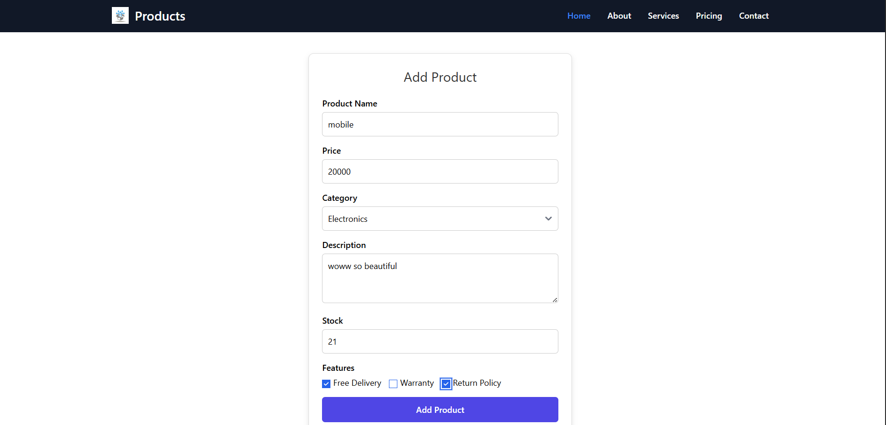
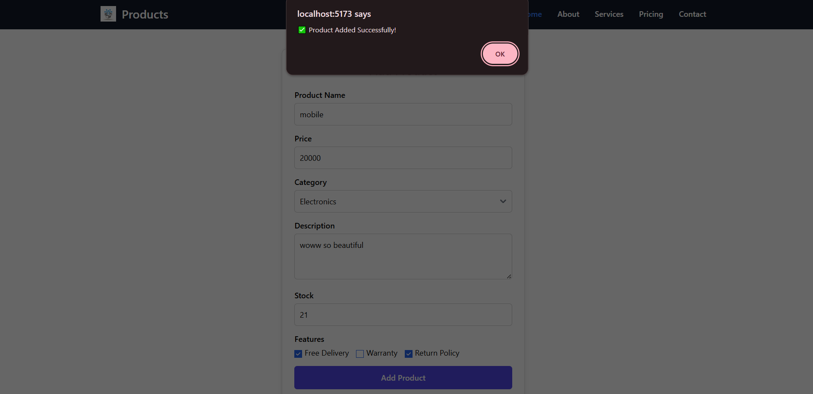
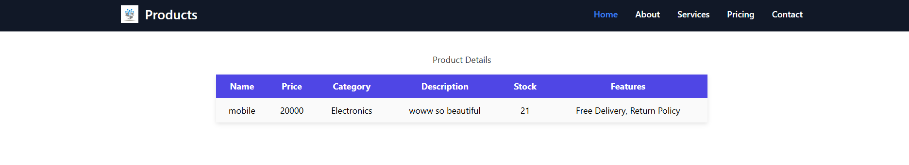

# 🛒 Product  System (React + TypeScript)

A simple **React + TypeScript** based product management system with a **responsive Navbar** and a **Product Form** to add and display product details.  
This project demonstrates form handling, state management, and clean UI design using **TailwindCSS** and React Hooks.

---

## 🚀 Features
- ✅ Responsive Navbar with links (Home, About, Services, Pricing, Contact).  
- ✅ Product Form with validation (Name, Price, Category, Description, Stock, Features).  
- ✅ Feature selection with multiple checkboxes.  
- ✅ Clean Product Details Table after submission.  
- ✅ Modern UI with TailwindCSS styling.  
- ✅ Written in **TypeScript** for type safety.  

---

## 🛠️ Tech Stack
- **React 18 + Vite** ⚛️  
- **TypeScript** ✨  
- **TailwindCSS** 🎨  

---

## 📂 Folder Structure
product-management/
│── src/
│ ├── components/
│ │ ├── Navbar.tsx # Top navigation bar
│ │ ├── ProductForm.tsx # Product add/display form
│ ├── assets/ # Images & icons
│ ├── App.tsx # Main entry component
│ ├── main.tsx # React DOM render
│── public/ # Static files
│── package.json # Dependencies & scripts
│── tailwind.config.js # Tailwind configuration
│── tsconfig.json # TypeScript configuration
│── vite.config.ts # Vite configuration
│── README.md # Project documentation

## ⚙️ Installation

1. **Clone the repository**
   
   git clone https://github.com/ShrutiKathiriya-coder/React-JS/Student-App
   
   cd Sudent-App
   
2.Install dependencies
  npm install

3.Run the development server

 npm run dev

4.Open in your browser:

 http://localhost:5173/

📌 Usage

Open the Product Form from the UI.

👉Fill in details:

1.Product Name

2.Price

3.Category (Electronics, Fashion, Grocery, Toys)

4.Description

5.Stock

6.Features (Free Delivery, Warranty, Return Policy)

7Submit → Your product will appear in a table view.

📸 Screenshots

### 🏷️ Product Form Page

---

### ✅ Success Message

---

### 📊 Product Details Table

Product Form UI

Product Details Table

🤝 Contributing

Pull requests are welcome! Please fork this repo and submit a PR if you’d like to improve the UI or add features.
