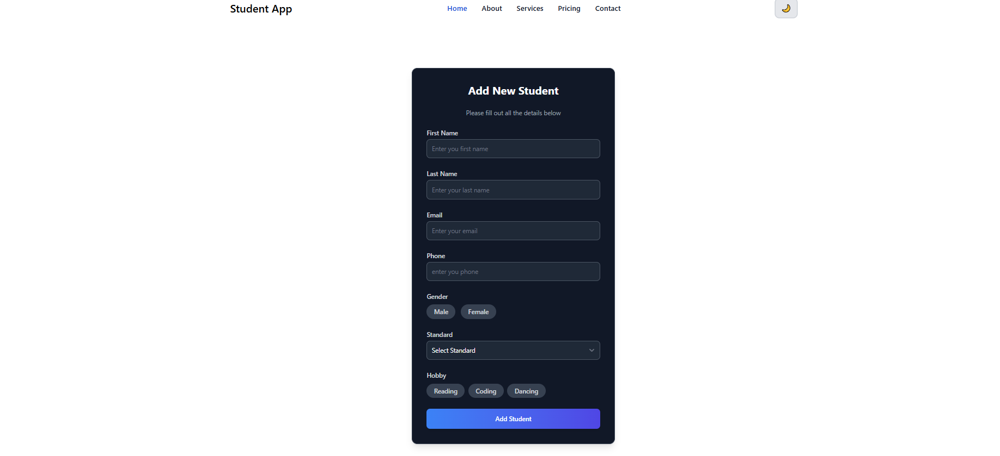
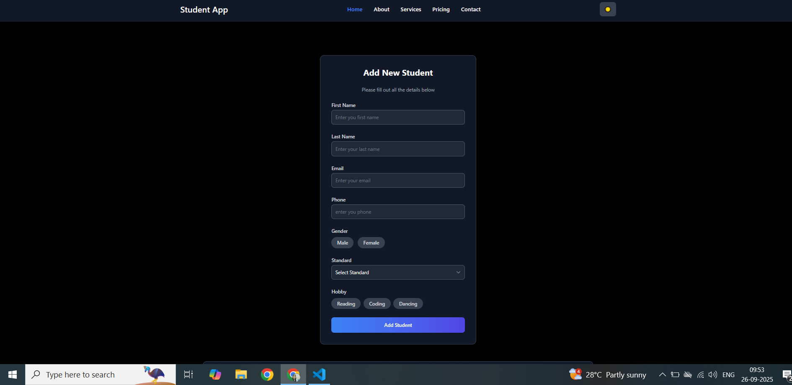

# 🎓 Student App

A React-based student management app with:
- 🌗 **Light/Dark Theme Toggle** (saved in localStorage)
- 📝 **Student CRUD Form** (Add, Edit, Delete)
- 📦 **LocalStorage Persistence**
- ✅ **Form Validation**
- 🔔 **Toast Notifications (react-toastify)**
- ⚡ **SweetAlert2 Modals**
- 📱 **Responsive Design with TailwindCSS**

---

## 🚀 Features
- **Navbar** with theme toggle (light/dark)
- **Add / Update / Delete Students**
- **Form validation** (name, email, phone, gender, standard, hobby)
- **Data persistence** using `localStorage`
- **Beautiful UI** with TailwindCSS + Dark Mode
- **Alerts & Toasts** for better UX
- **Offline Mode Handling**

---

## 📂 Project Structure
student-app/
│── src/
│ ├── components/
│ │ ├── Navbar.tsx
│ │ ├── Studentform.tsx
│ ├── App.tsx
│ ├── main.tsx
│── public/
│── package.json
│── tailwind.config.js
│── tsconfig.json
│── README.md

---

## 🛠️ Installation & Setup

### 1️⃣ Clone Repository

git clone https://github.com/shrutikathiriyacoder/Student-form.git
cd student-app

2️⃣ Install Dependencies
npm install

3️⃣ Run Development Server
npm run dev

4️⃣ Build for Production
npm run build

## 📸 Screenshots

### 🔹 Light Mode

### 🔹 Dark Mode

📦 Tech Stack

1 React + TypeScript

2 TailwindCSS

3 React Toastify

4 SweetAlert2

5 LocalStorage

✅ Usage

1 Add student details (first name, last name, email, phone, gender, standard, hobbies).

2 Edit or delete students from the table.

3 Switch between light and dark themes (state saved in localStorage).

4 Works fully offline (data saved locally).

# 📜 License

# This project is licensed under the MIT License.

👩‍💻 Author

Developed by shruti kathiriya ✨

