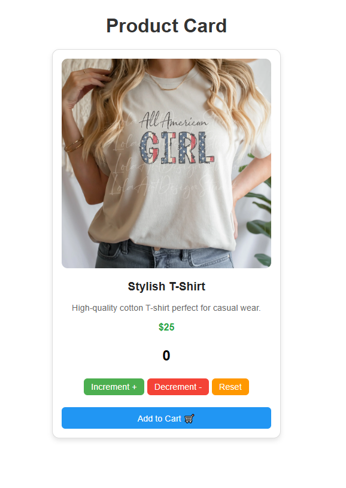

# 🛒 React Product Card Counter App

This is a simple and interactive **Product Card App** built with **React.js**. The application features a product display with an **increment/decrement/reset counter**, simulating quantity selection for a product.

---

## 📸 Preview



---

## 🚀 Features

- Beautiful product card layout
- Counter with:
  - ✅ Increment (max limit: 50)
  - ✅ Decrement (min limit: 0)
  - 🔄 Reset to 0
- Limit alerts for both max/min
- Add to Cart button (dummy)
- Fully responsive and styled with CSS

---

## ⚙️ Technologies Used

- **React.js** (Functional Components & useState)
- **CSS** for layout and styling

---

## 📦 Installation

1. **Clone the repo**


cd react-product-card
npm install
npm run dev

```
/public
  └── css/
       └── App.css         
/src
  └── App.jsx
    └── main.jsx          

```
💡 How It Works
👉Counter is controlled via useState

👉increment() increases the count till 50

👉decrement() decreases the count till 0

👉Alerts are shown when limit is hit

👉Reset brings count back to zero


📬 Contact
Feel free to reach out for collaboration or feedback:

✉️ Email: shrutiikathiriya@gmail.com

🔗 GitHub: ShrutiKathiriya-coder

📄 License
This project is open-source and free to use under the MIT License.
