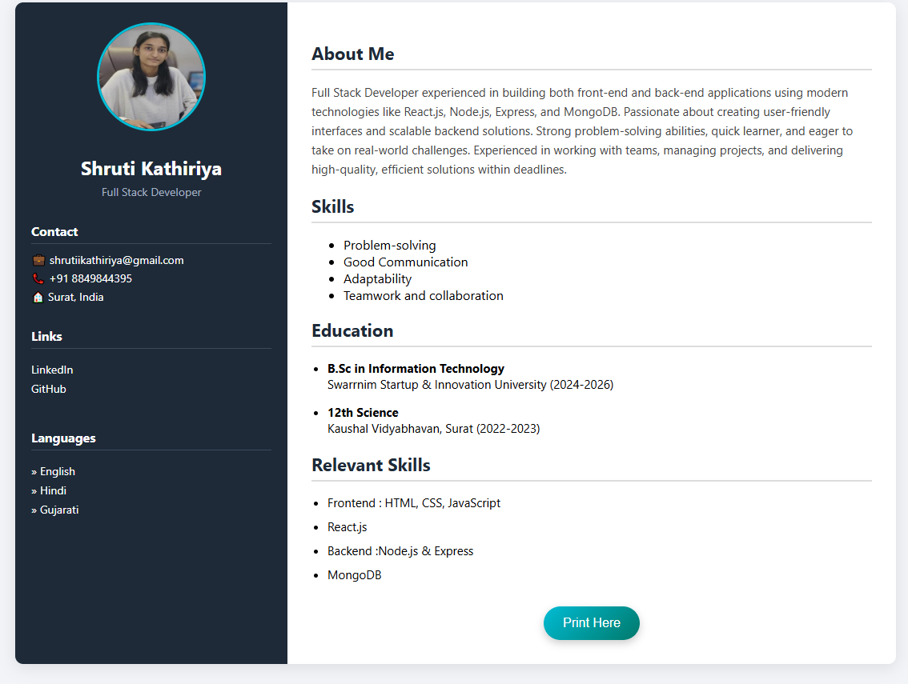
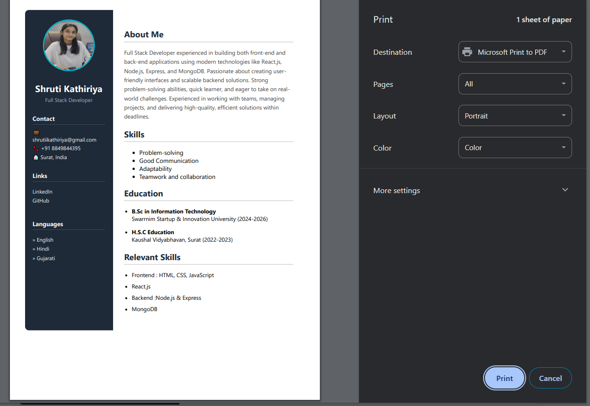

# 💼 Shruti Kathiriya - React Resume App

This is a personal resume web application built using **React.js**. It showcases my profile, skills, education, and technical stack, along with a **Print Resume** feature that preserves all colors and layout for a clean, professional printout.

---

## 📸 Preview




---

## 🔧 Tech Stack

- **Frontend**: React.js, HTML5, CSS3
- **Print Styling**: CSS `@media print` with color support
- **Deployment Ready**: Can be hosted on GitHub Pages, Netlify, or Vercel

---

## 🚀 Features

- Beautiful, responsive resume layout
- Profile image and contact information
- Skills and education section
- Print-ready with full color and layout preserved
- Button to trigger browser print
- Links to GitHub and LinkedIn

---

## 📂 Folder Structure
```
/src
├── App.jsx 
├── App.css 
├── main.jsx
/public
└── images/
└── shrutiimage.jpg 

```
---

## 🖨️ Print Feature

- Click the `Print Here` button at the bottom of the resume
- Uses `window.print()` to open the print dialog
- Styled with `@media print` to ensure **colors and layout remain intact**

---


---

## 📦 Installation


cd react-resume
npm install
npm start


📬 Contact
Email: shrutiikathiriya@gmail.com

LinkedIn: https://www.linkedin.com/in/shruti-kathiriya-00b8142ba

GitHub: https://github.com/ShrutiKathiriya-coder
